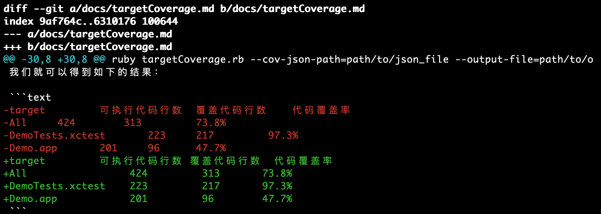
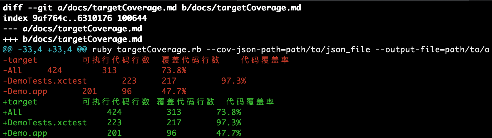

# git diff 数据解析

为了统计增量代码覆盖率，首先要获取增量代码，本文介绍如何快速准确地获取增量代码数据。

## 获取代码diff

### git diff 输出分析
相信大家都会使用`git diff`命令获取代码diff，比如在[UnitTestDemo项目](https://github.com/JerryChu/UnitTestDemo)中执行：

```
git diff e53b8299 a25e1cc3
```

将会获得如下的输出：



其中，`-`表示删除的行，`+`表示新增的行（修改其实就是删除+新增）；`@@ -30,8 +30,8 @@` 表示删除了原先从第30行开始的8行，新增了从第30行开始的8行。

从上面的diff结果中可以获取到如下信息：

- *targetCoverage.md* 文件发生了变更
- *targetCoverage.md* 从第30行到第37行，是本次变更的代码行。

### diff数据优化

但是 *targetCoverage.md* 文件只修改了4行代码（上图的红色/绿色部分），为什么diff结果说修改了8行呢？ 

实际上，出于对**效率**的考虑（同时也考虑了merge的准确性等），git在做diff时并不是逐行做比较的，而是默认以**3行**作为一个*对比单元*，只要对比单元内有数据发生了变更，就认为这个单元是发生了变更的。所以我们看到虽然只修改了4行，`git diff`的结果却说有8行发生了变更。至于为什么在这次diff下是8行，大家可以再思考一下。    

虽然`git diff`的这个默认行为不会影响到diff的展示（我们可以看到上图红色/绿色部分确实是4行），但是却会对我们统计新增/修改代码行造成困扰。比如这次只修改了4行，但是`git diff`说有8行变更，导致统计到的数据**偏大**。  

如何解决这个问题呢？需要进一步对`git diff`进行深入研究。

从`git diff` 的帮助文档中可以看到一个有意思的参数：  

```
-U<n>
--unified=<n>
Generate diffs with <n> lines of context instead of the usual three. Implies --patch. Implies -p.
```

也就是说，我们可以通过设置 *unified* 的值，来修改 `git diff` 的默认行为。尝试再命令行中执行：

```
git diff e53b8299 a25e1cc3 --unified=0
```  

将会获得如下的输出：



可以看到，加上`--unified=0`之后，`git diff`的新增/修改行数统计就是准确的了。  

## 解析diff数据

拿到准确的diff数据之后，我们还需要把`git diff`输出的数据转化为代码可以读取的数据。对于增量代码统计，我们希望获取到如下数据：

- 所有变更文件的文件名
- 每个变更文件对应的的所有变更代码行

其实`git diff`输出的结果中已经包含了这两份数据，我们要做的就是从输出的结果中解析出这些数据。   

本项目提供 [*diffParser.rb*](../utils/diffParser.rb) 用于从`git diff`的输出结果中解析出最终需要的数据。  

在命令行中执行

```
git diff e53b8299 a25e1cc3 --unified=0 > a.diff

ruby utils/diffParser.rb --diff-file=a.diff
```

就会获得如下的数据

```
{"docs/targetCoverage.md"=>[33, 34, 35, 36]}
```

其中，*key* 为所有发生变更的文件名，*value* 为该文件对应的变更代码行（新增/修改的代码行）。  

## 总结

通过使用`git diff`命令，并对输出结果进行自定义的解析，我们就可以很容易地获取到新增代码数据了。下一篇文章会继续介绍如何在已经有了增量代码数据的基础上仅一步统计增量代码覆盖率。